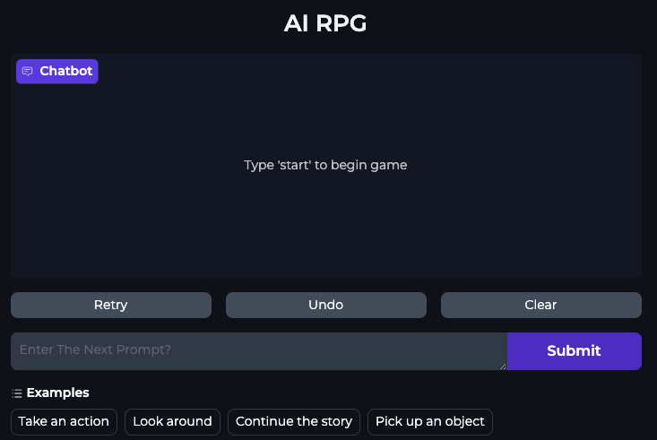

## 🚀 Project Overview

1. **Create immersive AI-generated worlds**: Use hierarchical content generation to develop kingdoms, towns, characters, and etc.
2. **Build AI-powered game mechanics**: Design inventory systems and other structured game state tracking mechanisms.
3. **Ensure AI safety**: Implement content moderation and compliance systems using tools like Llama Guard.
4. **Optimize AI performance**: Practice techniques to enhance efficiency while keeping operational costs low.

  

---
### 1. **Hierarchical Content Generation**
   - Build game worlds through prompt engineering.
   - Generate structured hierarchies (kingdoms, towns, characters, etc.).

### 2. **Interactive AI Applications**
   - Integrate the generated world into a playable game.
   - Create dynamic, text-based interactive elements.

### 3. **Moderation & Safety**
   - Explore content moderation using Llama Guard.
   - Create and enforce custom content safety policies.

### 4. **Implementing Game Mechanics**
   - Develop mechanics for inventory and state tracking.
   - Parse text data into structured JSON for game logic.

---

## 🛠️ Tools & Frameworks

- **Large Language Models (LLMs)**: For world creation and narrative design.
- **JSON**: To structure game states and inventories.
- **Llama Guard**: For content safety and moderation.

---

## 📚 Learning Outcomes

- Design an AI-powered, interactive game from scratch.
- Understand prompt engineering and hierarchical content generation.
- Build AI applications with real-world safety and compliance measures.
- Explore creative and scalable AI techniques for game development.

---

## 🙌 Acknowledgments

Thanks to Together AI, AI Dungeon, and the DeepLearning.AI team for their contributions to this project, and making this interactive game a very fun experience.
